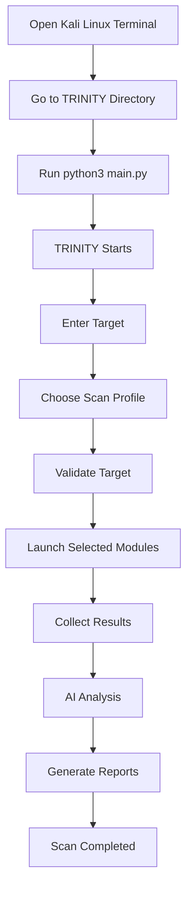
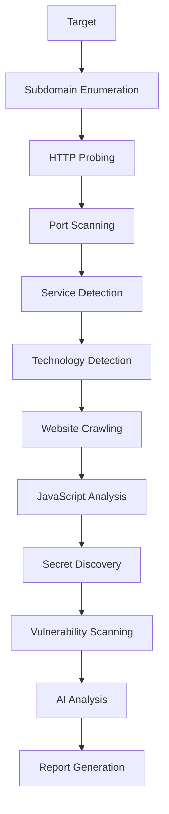

TRINITY is a modular, terminal-based reconnaissance framework designed for Kali Linux. It automates the initial stages of penetration testing by integrating multiple open-source security tools into a single interactive interface.

Instead of manually running each reconnaissance tool separately, TRINITY executes them in a structured workflow, parses the results, performs AI-assisted analysis, and generates professional reports.

---

# ⚠ Disclaimer

TRINITY is intended **only for authorized penetration testing, bug bounty programs, lab environments, and security assessments where you have explicit permission to test the target.**

---

# 🖥 System Requirements

| Requirement | Minimum |
|-------------|----------|
| Operating System | Kali Linux (Recommended) |
| Python | 3.10+ |
| Go | 1.20+ |
| RAM | 4 GB |
| Recommended RAM | 8 GB+ |
| CPU | Dual Core |
| Recommended CPU | Quad Core |
| Disk Space | 2 GB |
| Internet | Required |

---

# 📦 Required Tools

Install the following tools before running TRINITY.

- Nmap
- Naabu
- Subfinder
- HTTPX
- WhatWeb
- Katana
- LinkFinder
- SecretFinder
- Nuclei

---

# 📂 Project Structure

```text
TRINITY/

├── assets/
├── config/
├── logs/
├── modules/
│   ├── recon/
│   ├── scanners/
│   ├── crawlers/
│   ├── reporting/
│   └── utils/
│
├── reports/
├── output/
├── requirements.txt
├── README.md
└── main.py
```

---

# 🚀 Installation

Clone the repository

```bash
git clone https://github.com/YOUR_USERNAME/TRINITY.git

cd TRINITY
```

Install Python requirements

```bash
pip install -r requirements.txt
```

Install all required reconnaissance tools.

---

# ▶ Running TRINITY

## Step 1

Open **Kali Linux Terminal**

---

## Step 2

Navigate to the project directory.

```bash
cd /path/to/TRINITY
```

Example

```bash
cd ~/Desktop/TRINITY
```

---

## Step 3

Start TRINITY.

```bash
python3 main.py
```

or

```bash
python main.py
```

---

## Step 4

The TRINITY banner will appear.

Example

```
████████╗██████╗ ██╗███╗   ██╗██╗████████╗██╗   ██╗
╚══██╔══╝██╔══██╗██║████╗  ██║██║╚══██╔══╝╚██╗ ██╔╝
   ██║   ██████╔╝██║██╔██╗ ██║██║   ██║    ╚████╔╝
   ██║   ██╔══██╗██║██║╚██╗██║██║   ██║     ╚██╔╝
   ██║   ██║  ██║██║██║ ╚████║██║   ██║      ██║
   ╚═╝   ╚═╝  ╚═╝╚═╝╚═╝  ╚═══╝╚═╝   ╚═╝      ╚═╝
```

---

## Step 5

Enter the target.

Example

```
example.com
```

or

```
192.168.1.100
```

---

## Step 6

Select a scan profile.

```
1. Fast Scan

2. Standard Scan

3. Deep Scan

4. Full Scan

5. Custom Scan
```

---

## Step 7

TRINITY automatically starts the selected modules.

The scan progress will be displayed in real time.

---

## Step 8

After completion TRINITY generates

- Terminal Summary
- HTML Report
- JSON Report
- Markdown Report
- Logs

Reports are saved inside

```
reports/
```

or

```
output/
```

---

# 🔄 Complete Execution Flow



---

# 🔍 Reconnaissance Workflow



---

# ⚙ Internal Architecture

```mermaid
flowchart LR

User

--> CLI

CLI

--> Scan Engine

Scan Engine

--> Nmap

Scan Engine

--> Naabu

Scan Engine

--> HTTPX

Scan Engine

--> Subfinder

Scan Engine

--> Katana

Scan Engine

--> LinkFinder

Scan Engine

--> SecretFinder

Scan Engine

--> Nuclei

Nmap --> Parser
Naabu --> Parser
HTTPX --> Parser
Subfinder --> Parser
Katana --> Parser
LinkFinder --> Parser
SecretFinder --> Parser
Nuclei --> Parser

Parser

--> AI Engine

AI Engine

--> Reports

Reports

--> User
```

---

# 🎯 Scan Profiles

### Fast Scan

- Target Validation
- Top Port Scan
- Basic Service Detection

---

### Standard Scan

- Fast Scan
- Service Detection
- OS Detection
- Default NSE Scripts

---

### Deep Scan

- Standard Scan
- Advanced Enumeration
- Traceroute
- Extended Scripts

---

### Full Scan

- All TCP Ports
- Complete Enumeration
- Full Service Detection
- Vulnerability Scanning

---

### Custom Scan

Run only the modules selected by the user.

---

# 📊 Generated Reports

TRINITY generates

- HTML Report
- Markdown Report
- JSON Report
- Scan Logs
- AI Summary

---

# 🛣 Roadmap

- AI-powered Recon Analysis
- Parallel Scan Engine
- Plugin Marketplace
- Docker Support
- Burp Suite Integration
- Interactive Dashboard
- Automatic Updates
- CVSS Risk Scoring
- REST API
- Asset Inventory

---

# 👨‍💻 Author

**Pranav Sharma**

Cybersecurity Student

Penetration Testing • Linux • Python • Recon Automation

---

# 📜 License

MIT License

---

# ⭐ Support

If you found TRINITY useful, consider giving the repository a **Star ⭐** on GitHub.
